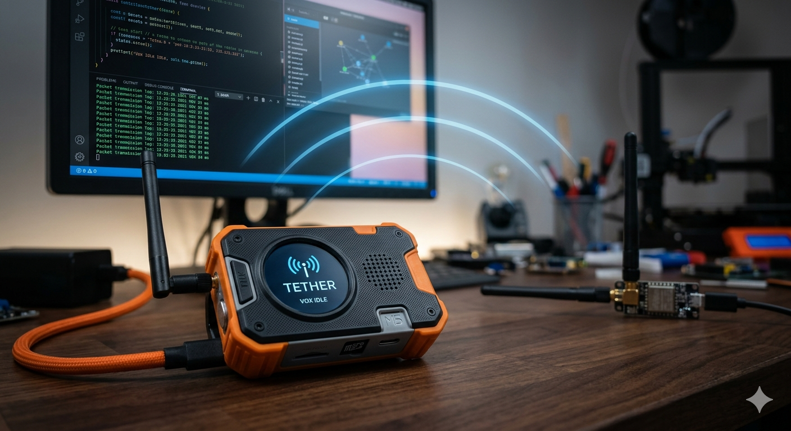

# Tether

Asynchronous, half-duplex, push-to-talk (PTT) voice and text messenger that bridges a portable LoRa radio to a PC base station, and from there into **Matrix** rooms and **Forge** AI agent sessions.

<p align="center">
  
</p>

```
┌────────────────┐   LoRa (US915, SF11/BW125)   ┌─────────────────┐
│  ThinkNode M5  │ ◄─────────────────────────► │   RAK4631       │
│  (ESP32-S3 +   │   store-and-forward,        │   (nRF52840 +   │
│   SX1262)      │   Opus 16 kbps,             │   SX1262)       │
│  PTT, EPD,     │   per-chunk ACKs,           │   bridge fw     │
│  speaker+mic   │   AES-128-CTR               └────────┬────────┘
└────────────────┘                                       │ USB-Serial
                                                         ▼
                                              ┌─────────────────────┐
                                              │   tetherd (Go)      │
                                              │   • Parakeet-TDT STT│
                                              │   • Piper TTS       │
                                              │   • mautrix-go      │──── Matrix rooms
                                              │   • forge client    │──── Forge sessions
                                              │   • PulseAudio sink │
                                              └─────────────────────┘
```

Audio is captured on the M5, compressed with Opus @ 16 kbps, buffered in PSRAM, written to SD, fragmented over LoRa, reassembled on the PC, transcribed with **NVIDIA Parakeet-TDT**, and dispatched as text into the appropriate Matrix room or Forge session. Replies stream back the same way: text → Piper TTS → Opus → LoRa → speaker on the M5.

The system supports up to **16 simultaneous conversations** (Matrix rooms and/or Forge sessions), each appearing as a discrete "channel" on the M5 with its own scrollable history. Range is prioritized over speed (custom SF11/BW125/CR 4/8 preset). 2–5 km line-of-sight with stock antennas.

## Status

**Pre-implementation / research phase.** No code is checked in yet — the design is locked in `research.md` and `hardware.md`. The 9-phase implementation plan in `research.md` §17 begins with a Go data-plane scaffold (no embedded work, no hardware required for the first phase).

| Phase | Description | Status |
|---|---|---|
| 0 | Tooling & schemas | not started |
| 1 | Go data plane (loopback) | not started |
| 2 | RAK4631 bridge firmware | not started |
| 3 | M5 FreeRTOS skeleton | not started |
| 4 | EPD + multi-conversation | not started |
| 5 | STT (Parakeet) + TTS (Piper) | not started |
| 6 | Matrix appservice | not started |
| 7 | Forge integration | not started |
| 8 | Hardening | not started |

## Hardware

See [`hardware.md`](hardware.md). Summary:

* **Handheld** — Elecrow ThinkNode M5 (ESP32-S3, SX1262, 1.54″ EPD, 1200 mAh, 8 MB PSRAM), INMP441 I²S mic, Adafruit I²S class-D amp + speaker, microSD over SPI.
* **Bridge** — RAKwireless RAK4631 (nRF52840 + SX1262), USB-Serial.
* **Base station** — PC (Linux preferred) running `tetherd` (Go).

## Integrations

| System | Role |
|---|---|
| **Matrix** (`maunium.net/go/mautrix` appservice) | Bidirectional text. Tether is a puppeted user. |
| **Forge** (`jbutlerdev/forge`) | Durable AI agent sessions. Each session = one Tether conversation. Voice → STT → `POST /messages`; SSE events → TTS → voice. |
| **sherpa-onnx** | Parakeet-TDT 0.6B v2 ONNX runtime for STT. |
| **piper1-gpl** | Piper ONNX TTS runtime. |

## Repository layout

```
tether/
├── README.md          # this file
├── AGENTS.md          # working guide for AI agents
├── hardware.md        # bill of materials
├── research.md        # complete design (the source of truth — start here)
├── docs/
│   └── preview.png    # README preview image
└── LICENSE
```

There is no source code yet. When implementation begins, the layout will be:

```
tether/
├── go/                  # tetherd (Go daemon)
│   ├── cmd/tetherd/     # entry point
│   ├── internal/
│   │   ├── serial/      # RAK4631 bridge protocol
│   │   ├── radio/       # packet fragmentation + ACK state machine
│   │   ├── codec/       # Opus encode/decode wrappers
│   │   ├── stt/         # Parakeet via sherpa-onnx cgo
│   │   ├── tts/         # Piper subprocess pipe
│   │   ├── matrix/      # mautrix-go appservice
│   │   ├── forge/       # HTTP + SSE client
│   │   ├── audio/       # PulseAudio / VB-Cable sink
│   │   └── conv/        # conversation state machine
│   ├── pkg/protocol/    # wire format (shared with firmware)
│   └── tetherd.toml
├── firmware/m5/         # ESP-IDF project for ThinkNode M5 (C++)
├── firmware/bridge/     # PlatformIO project for RAK4631 (C++)
├── proto/               # shared protocol definitions
├── scripts/             # provisioning, OTA, etc.
└── docs/
```

## Quick start (when code lands)

```bash
# Clone
git clone https://github.com/jbutlerdev/tether
cd tether

# Set up Go daemon
cd go
go mod download
go build -o tetherd ./cmd/tetherd
cp tetherd.toml.example tetherd.toml
$EDITOR tetherd.toml          # fill in matrix + forge + serial settings

# Provision models
./scripts/fetch-models.sh     # pulls parakeet-tdt-0.6b-v2-int8 + piper voices

# Run
./tetherd
```

## Development

* **Build daemon:** `cd go && go build ./...`
* **Run tests:** `cd go && go test ./...`
* **Build M5 firmware:** `cd firmware/m5 && idf.py build`
* **Build bridge firmware:** `cd firmware/bridge && pio run`
* **Flash:** `cd firmware/m5 && idf.py -p /dev/ttyUSB0 flash`

See [`AGENTS.md`](AGENTS.md) for the full working guide (conventions, common tasks, gotchas).

## License

MIT — see [`LICENSE`](LICENSE).

## Related

* **[jbutlerdev/forge](https://github.com/jbutlerdev/forge)** — durable AI agent sessions (Rust + pi-mono)
* **[mautrix-go](https://github.com/mautrix/go)** — Matrix framework used for the appservice
* **[sherpa-onnx](https://github.com/k2-fsa/sherpa-onnx)** — STT runtime for Parakeet
* **[piper1-gpl](https://github.com/OHF-Voice/piper1-gpl)** — TTS runtime
* **[RadioLib](https://github.com/jgromes/RadioLib)** — LoRa driver for both M5 and bridge
